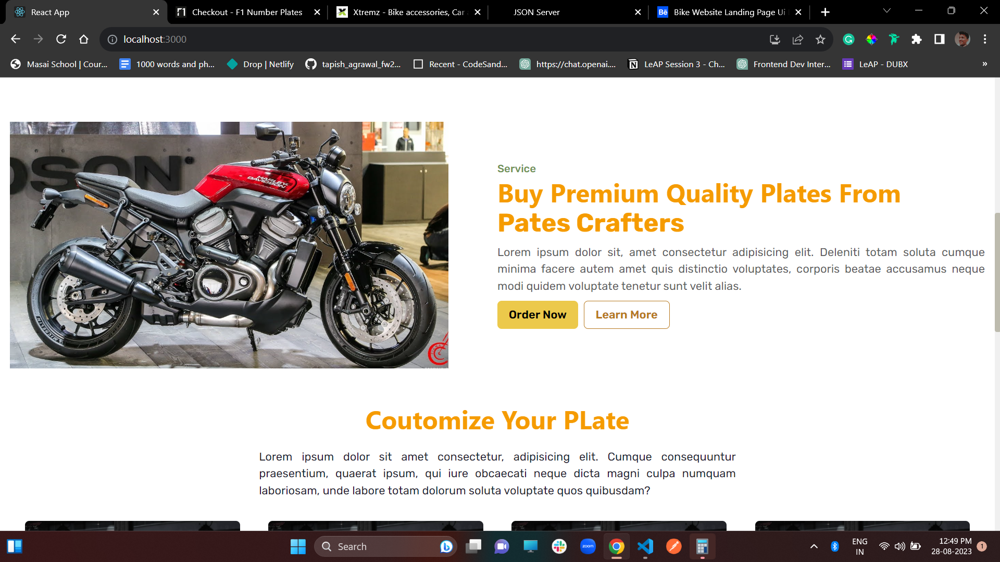
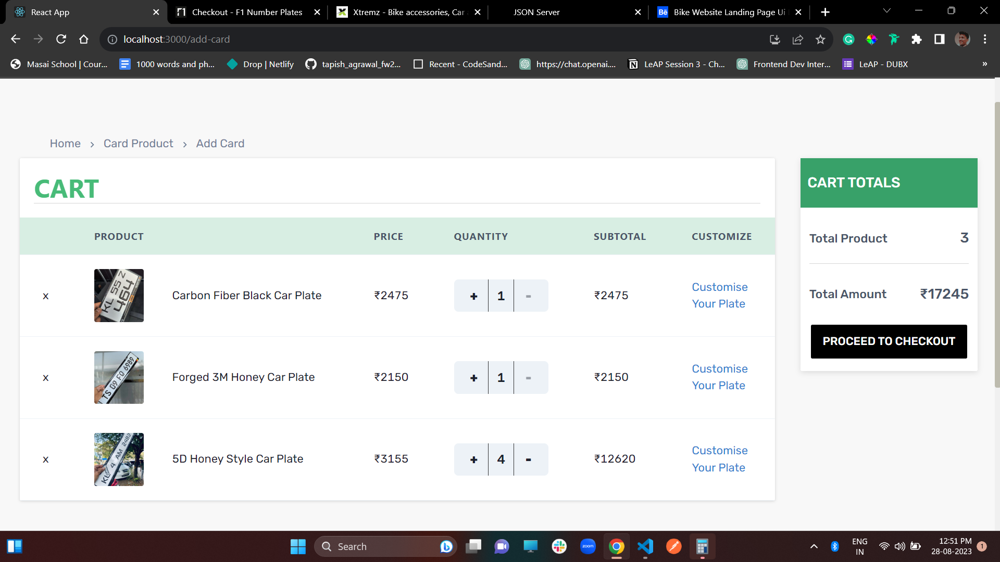
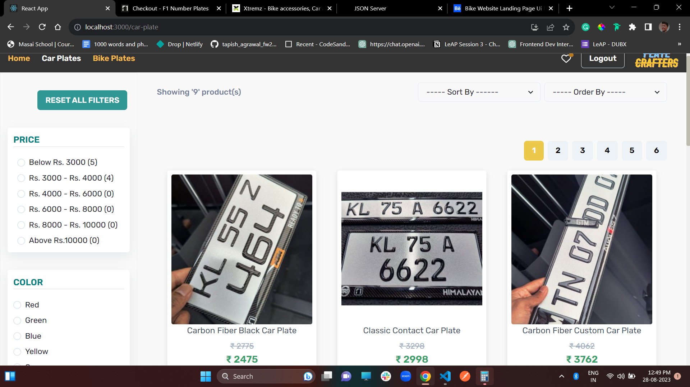
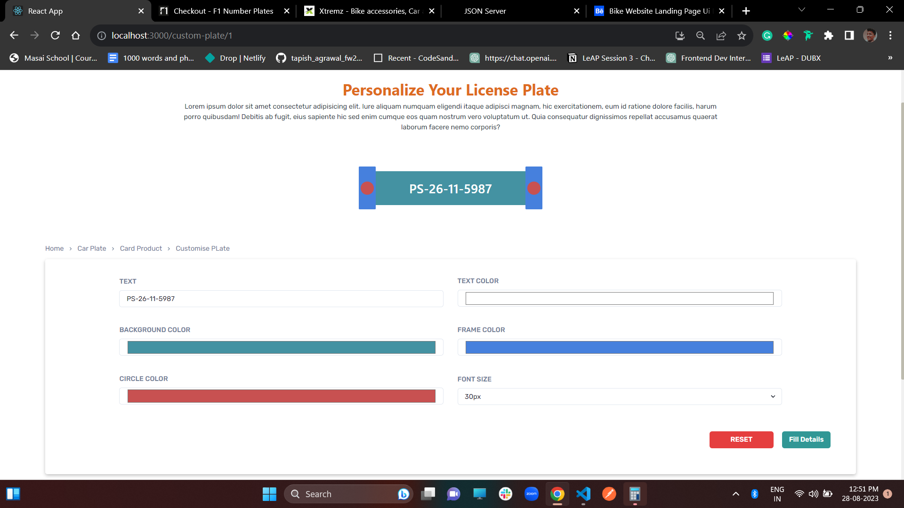
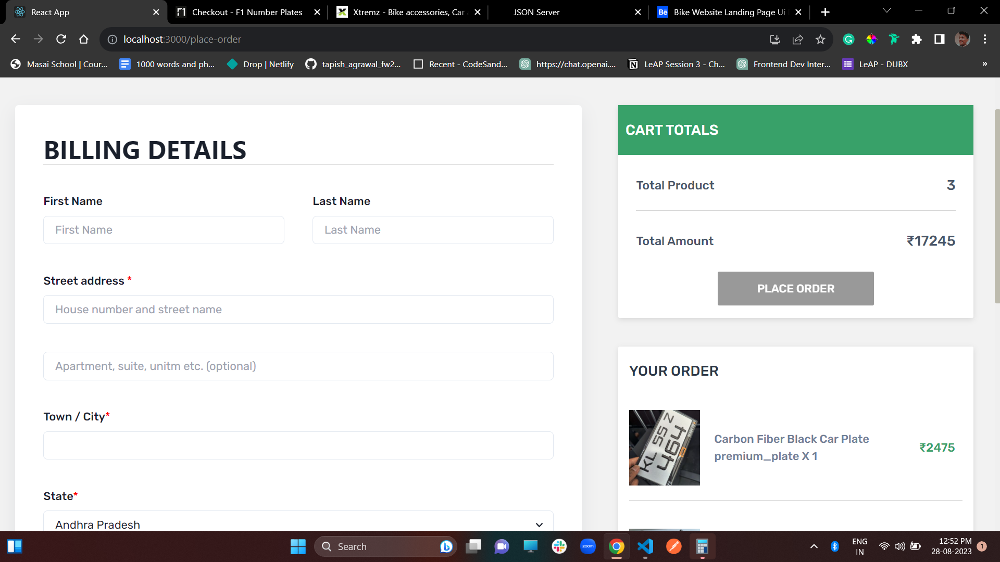
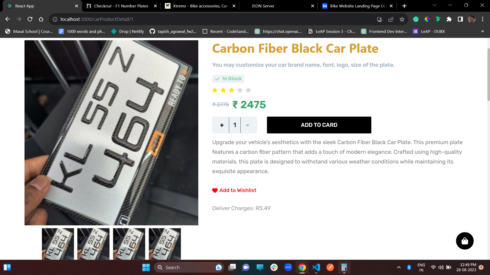
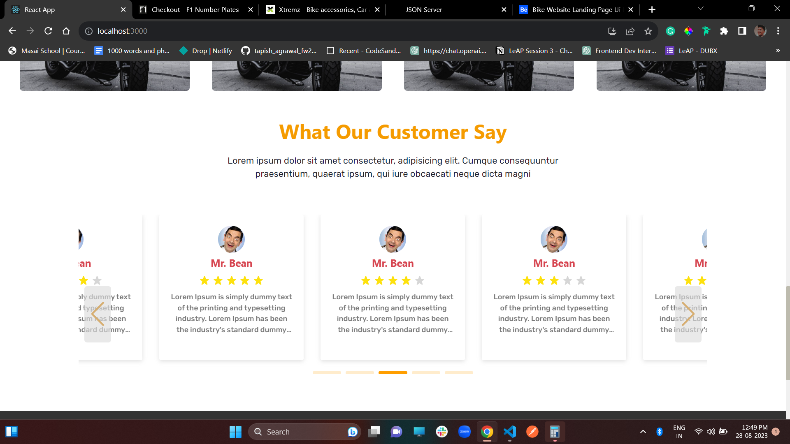
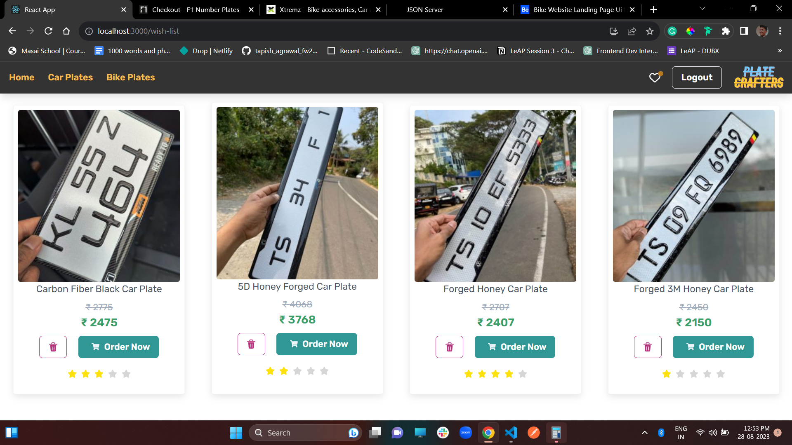

<h1>Plate Crafter (PayWise-From CaseStudy)</h1>
Plate Crafter specializes in custom vehicle license plate creation.
### The Goal:
The goal of Plate Crafters is to provide a convenient and user-friendly platform for making licenses. I am working on this project to make Uniq Premium, more affordable, and more for users.

### Design Process:
To help us prioritize and understand the user's needs, and challenges, We designed a Feedback form that will help us every time to go through user expectations and needs regarding this website.

### Outcome: 
I grew and learnt a lot while working on this product, how to collaborate efficiently as a design team and work within the timeline to deliver Plate Crafters.
I also learnt about designing with user feedback instead of assumption and it increased our work progress.

<h1>Teck Stack :</h1>

 <li>REACT</li>
  <li>JSX</li>
  <li>SWIPER JS</li>
  <li>SEEWT ALERT</li>
  <li>CHARA UI</li>
  <li>LocalStorage</li>
  <li>Mock Servers</li>

---
# More Info :

### This website is made from a study of Expert Fix:  https://www.behance.net/gallery/165978761/Bike-Website-Landing-Page-Ui-Design?tracking_source=search_projects%7Ctravelling+website

### Netlify link : 

## Output :

---

<h1>Features :</h1>

 <li>Login</li>
  <li>Sign Up</li>
  <li>Logout</li>
  <li>View Single Card</li>
  <li>Customize Plate</li>
  <li>Filtering</li>
  <li>Sorting</li>
  <li>CURD Operation</li>

#### Given name : futuristic-amount-4935

[fw27_177-Tapish Agrawal](https://github.com/Tapishagrawal)

